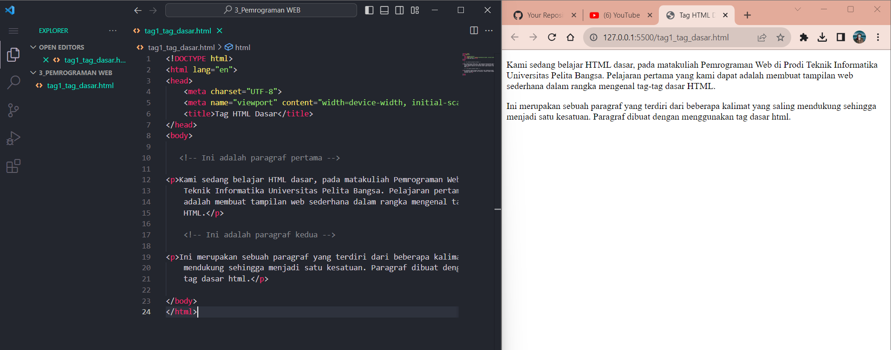

# Tugas Praktikum { Pertemuan ke 2 } 


|**Nama**|**NIM**|**Kelas**|**Matkul**|
|----|---|-----|------|
|Muhammad Ikhsan Fakhrudin|312210019|TI.22.A.2|Pemrograman WEB|

# HTML Dasar

## Langkah-Langkah Praktikum

Membuka ``text editor`` , di sini saya menggunakan ***Visual Studio Code.***


## 1. Membuat Paragraf



## 2. Menambahkan Judul


## 3. Memformat Text


## 4. Menyisipkan Gambar


## 5. Menambahkan Hyperlink


## Jawab Pertanyaan Berikut :

1. Lakukan perubahan pada kode sesuai dengan keinginan anda, amati perubahannya adakah error ketika terjadi kesalahan penulisan tag?

2. Apa perbedaan dari tag ``<p>`` dengan tag ``<br>``, berikan penjelasannya!

3. Apa perbedaan atribut title dan alt pada tag ````, berikan penjelasannya!

4. Untuk mengatur ukuran gambar, digunakan atribut width dan height. Agar tampilan gambar proporsional sebaiknya kedua atribut tersebut diisi semua atau tidak? Berikan penjelasannya!

5. Pada link tambahkan atribut target dengan nilai atribut bervariasi ( _blank, _self, _top, _parent ), apa yang terjadi pada masing-masing nilai antribut tersebut?

## Jawab (soon)


## SELESAI  
