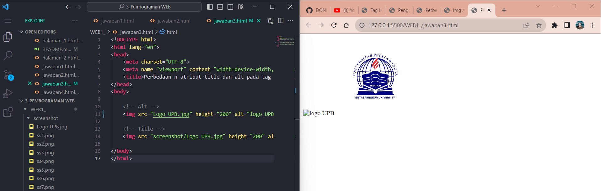
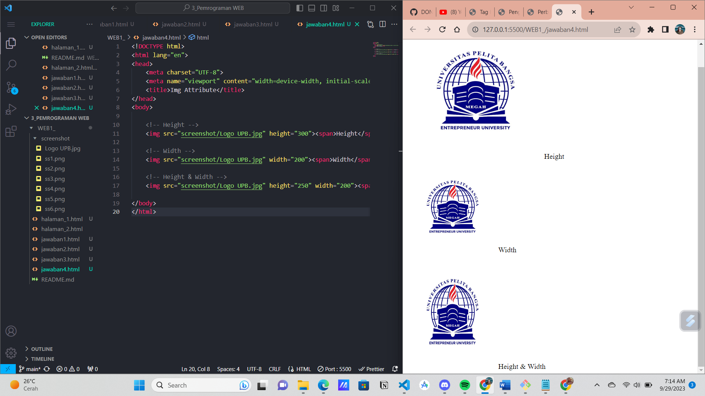

# Tugas Praktikum { Pertemuan ke 2 } 


|**Nama**|**NIM**|**Kelas**|**Matkul**|
|----|---|-----|------|
|Muhammad Ikhsan Fakhrudin|312210019|TI.22.A.2|Pemrograman WEB|

# HTML Dasar

## Langkah-Langkah Praktikum

Membuka ``text editor`` , di sini saya menggunakan ***Visual Studio Code.***


## 1. Membuat Paragraf


## 2. Menambahkan Judul


## 3. Memformat Text


## 4. Menyisipkan Gambar


## 5. Menambahkan Hyperlink


## Jawab Pertanyaan Berikut :

1. Lakukan perubahan pada kode sesuai dengan keinginan anda, amati perubahannya adakah error ketika terjadi kesalahan penulisan tag?

2. Apa perbedaan dari tag ``<p>`` dengan tag ``<br>``, berikan penjelasannya!

3. Apa perbedaan atribut title dan alt pada tag ````, berikan penjelasannya!

4. Untuk mengatur ukuran gambar, digunakan atribut width dan height. Agar tampilan gambar proporsional sebaiknya kedua atribut tersebut diisi semua atau tidak? Berikan penjelasannya!

5. Pada link tambahkan atribut target dengan nilai atribut bervariasi ( _blank, _self, _top, _parent ), apa yang terjadi pada masing-masing nilai antribut tersebut?

## Jawab 

1. Saya akan melakukan perubahan pada tag html, gambar dibawah merupakan syntax HTML sebelum saya rubah


Lalu ketika saya menambahkan ``<i>``, pada paragraf kedua maka seluruh teks yang bermula normal akan berubah menjadi teks yg bergaris miring semua atau ``italic``, seperti gambar di bawah.


2. Tag ``<br>`` berfungsi untuk melompati satu line, cocok untuk memulai paragraf baru, sedangkan tag ``<p>`` seperti menekan tombol enter di software document editor atau seperti di ``Ms Word.``


3. ``Atribut Alt``

- Digunakan untuk memberikan teks alternatif atau deskripsi singkat tentang gambar. Ini adalah teks yang akan ditampilkan jika gambar tidak dapat dimuat atau ketika pengguna menggunakan peramban teks atau pembaca layar.

- **Tujuan Utama :** Memberikan informasi penting tentang gambar kepada pengguna yang memiliki keterbatasan penglihatan atau ketika gambar tidak dapat ditampilkan.

``Atribut Title``

- Digunakan untuk memberikan informasi tambahan tentang gambar saat pengguna mengarahkan kursor mouse ke gambar tersebut. Ini muncul dalam tooltip saat pengguna menggerakkan kursor mouse di atas gambar.

- **Tujuan Utama :** Memberikan keterangan atau informasi tambahan opsional yang dapat berguna, tetapi tidak harus diperlukan untuk memahami gambar.



4. Menurut saya lebih baik satu atribut saja agar aspek ratio gambar asli terjaga. Kecuali pada kondisi tertentu (seperti gambar yang sudah memiliki ukuran yg pas/proporsional) cukup mengatur ``Width`` nya saja.



5. ``Nilai _blank`` untuk membuka link di tab baru

    ``Nilai _self`` untuk membuka link/halaman ditab saat ini

    ``Nilai _top`` untuk membuka link/halaman dan membatalkan semua frame

    ``Nilai _parent`` untuk membuka link/halaman pada parent frame


## SELESAI  
